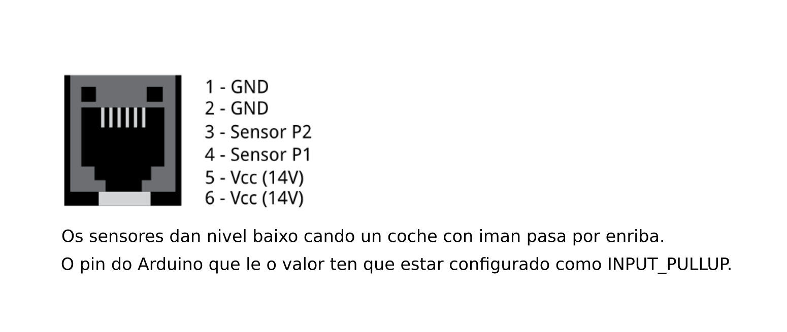
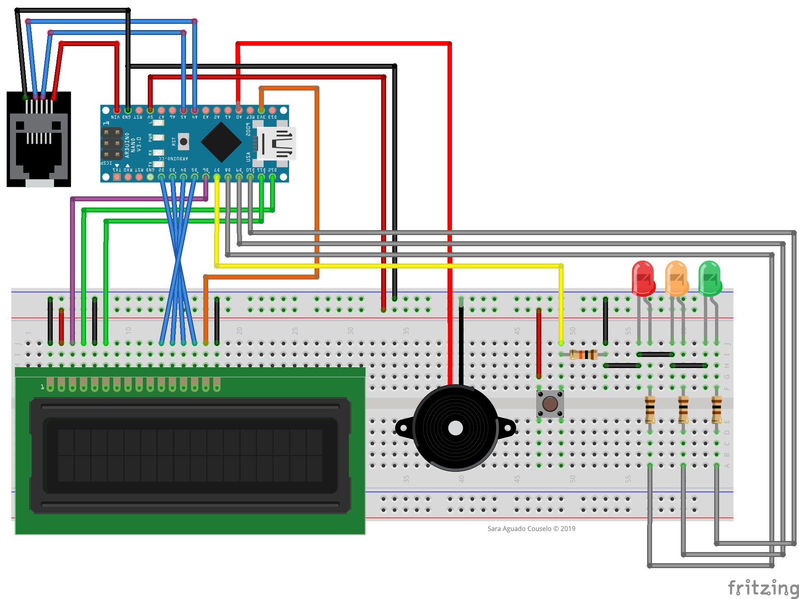

# contavoltas
Observando unha pista de carreiras de xoguete, ocorréuseme este pequeno proxecto. Trátase dun sistema de xestión de carreiras caseiro xestionado por Arduino, ao que irei engadindo funcionalidades (se teño tempo e por diversión).

> NOTA: ao empregar sensores magnéticos, este método non funciona con coches sen imán.

No meu caso, a pista (un Scalextric © Original C1 de dous carrís) xa inclúe na liña de meta dous sensores magnéticos, polo que só tiven que desmontar a pista e observar as conexións. Medindo a continuidade cun [multímetro] puiden determinar que o conector RJ12 (6 pines) que inclúe a miña pista funciona da seguinte maneira:

A fonte de alimentación utilizada polo circuito da 14V en continua, polo que deberemos reducila para poder utilizala como tensión de entrada do Arduino (entre 7 e 12 voltios). Para iso podemos montar un circuito [divisor de tensión] con dúas resistencias (se son de igual valor, dividirán a voltaxe á metade).

Finalmente, debemos pensar nos compoñentes a utilizar. Cunha pouca visión de futuro fixen unha montaxe con display LCD, pulsadores, un semáforo de leds e un zumbador. Só queda darlle á imaxinación á hora de programalo.

> Sara Aguado Couselo (2019)

[multímetro]:https://youtu.be/OD-VMmPyCo4
[divisor de tensión]:https://es.wikipedia.org/wiki/Divisor_de_tensi%C3%B3n
